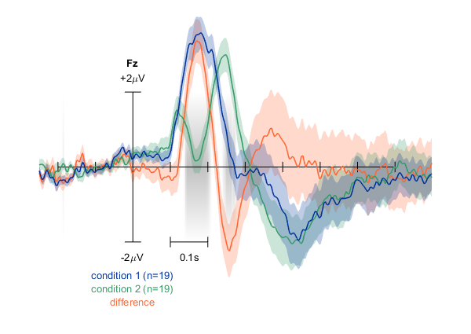
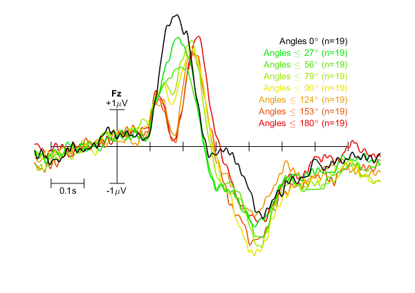

# plot_erp
plot_erp is a MATLAB-based script to plot event-related potentials (ERPs) from any number of given epoched datasets (in EEGLAB format), for a single channel. For each ERP curve, any number of datasets can be given. It can optionally calculate and plot a difference wave, standard errors of the mean, and permutation-based statistics (using an included local version of [permutationTest](https://github.com/lrkrol/permutationTest)). Mean curves and statistics can be calculated either within or between datasets.

Sample screenshots:

Two ERPs plus their difference, standard error of the mean for all curves, and statistics highlighting significant differences in grey.



ERPs for eight groups of 19 datasets each with custom colour code, labels, and x scale indicator position.



## Sample usage

Say you have epoched EEG data for two participants, and three conditions each: `p1c1`, `p1c2`, `p1c3`, `p2c1`, etc. Calling

```matlab
plot_erp({p1c1}, 'Fz');
```

will then plot the mean ERP of all epochs in `p1c1` at channel Fz. Calling

```matlab
plot_erp({p1c1, p2c1}, 'Fz', 'plotdiff', 1);
```

will plot the mean ERPs of participants one and two separately for condition one. Because `plotdiff` is `1`, the difference between these two will also be plotted.

```matlab
plot_erp({{p1c1, p2c1}, {p1c2, p2c2}}, 'Fz', 'plotdiff', 1, 'permute', 10000);
```

will first take the mean of each given dataset, before calculating the mean within the given conditions and plotting those. Where previously _n_ equalled the number of trials per dataset, here, _n = 2_ for each ERP. This is indicated in the legend for each trace. A permutation test of 10000 permutations will additionally be performed to find significant differences between the two conditions on a per-sample basis.

Any number of ERPs can be plotted. Just as 

```matlab
plot_erp({p1c1, p1c2, p1c3}, 'Fz');
```

will plot each condition separately for participant one (_n_ equalling the number of trials per dataset for each ERP), so will

```matlab
plot_erp({{p1c1, p2c1}, {p1c2, p2c2}, {p1c3, p2c3}}, 'Fz', 'plotstd', 'fill');
```

plot one grand average ERP for each condition. The `plotstd` argument additionally adds the standard error of the mean to each ERP (with, now again, _n = 2_). `plotdiff` and `permute` can only be used when two ERPs are requested. 

The number of datasets per ERP trace need not be equal. For example, calling

```matlab
plot_erp({{p1c1, p2c1}, p3c1}, 'Fz');
```

will compare the mean of participant one and two to that of participant three. Note that by default, whether or not to first average within datasets before averaging them together, or to average across all epochs, is determined by the number of datasets for the first trace. Here, _n_ would be 2 and 1, respectively. This behaviour can be changed by setting `avgmode`.

The script does not work directly with EEGLAB's study format. If, however, all study datasets are saved in memory, and they are ordered consistently, you can use the indices in ALLEEG to refer to specific conditions. For example, a study of 20 participants with 8 conditions each, all loaded in the same order as separate datasets, will have 160 datasets in ALLEEG. To plot the first three conditions against each other, you can use:

```matlab
plot_erp({ALLEEG(1:8:160), ALLEEG(2:8:160), ALLEEG(3:8:160)}, 'Cz');
```
